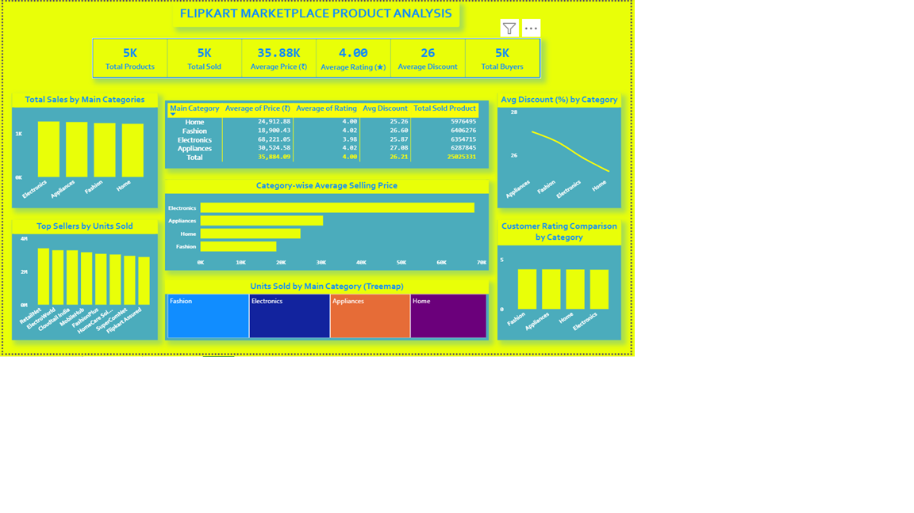
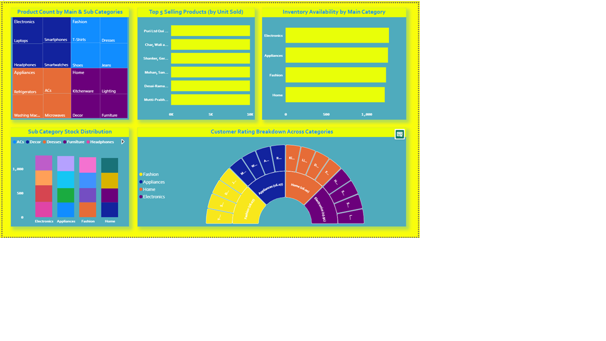

**🛒 Flipkart Product Analysis using Power BI**

📌 Project Overview

This project focuses on analyzing Flipkart product data to gain meaningful business insights using Power BI.
The dashboard helps understand sales performance, pricing trends, discounts, inventory status, and customer ratings across different product categories.

🎯 Objectives
	•	Analyze category-wise sales performance
	•	Compare average price and discount trends
	•	Identify top-selling products
	•	Study inventory availability
	•	Understand customer rating distribution
  
📊 Key Metrics
	•	Average Price
	•	Average Rating
	•	Average Discount
	•	Total Buyers
  
📈 Dashboard Pages

🔹 Page 1: Sales & Category Analysis
	•	Category-wise sales performance
	•	Average price vs discount comparison
	•	Top sellers based on units sold

🔹 Page 2: Inventory & Rating Analysis
	•	Product count by category and sub-category
	•	Inventory availability status
	•	Customer rating distribution

🖼 Dashboard Preview

  
  

🗂 Dataset
	•	Simulated Flipkart marketplace dataset
	•	Created for learning and analytical purposes

🛠 Tools & Technologies Used
	•	Power BI – Data visualization & dashboard creation
	•	Microsoft Excel / CSV – Data preprocessing
	•	GitHub – Project version control and sharing

📌 Key Insights
	•	Certain categories contribute significantly more to total sales
	•	Higher discounts often lead to increased buyer count
	•	Products with ratings above 4 tend to sell more
	•	Inventory gaps exist in high-demand categories

🚀 Conclusion

This project demonstrates the use of Power BI for business intelligence by converting raw e-commerce data into actionable insights.
It reflects strong skills in data analysis, visualization, and storytelling.

📎 Project Files
	•	FlipkartProductAnalysis.pbix – Power BI dashboard file
	•	dashboard_page1.png – Sales & Category Analysis
	•	dashboard_page2.png – Inventory & Rating Analysis
  
✨ Author

Chetna Bhopale
Aspiring Data Analyst | Power BI | SQL | Excel
